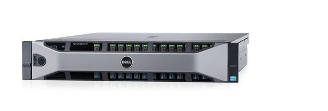
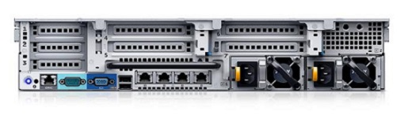
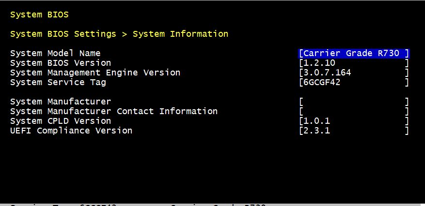

# Dell R730 for Wind River Cloud Platform
**Wind River Cloud Platform 20.06 Hardware Validation Guide**

<!-- /TOC -->

- [Description](#Description)
- [Tested Configurations](#Tested_Configurations)
- [Test Example Environment](##Test_Example_Environment)
- [Out of Band Managment Control](#Out_of_Band_Management_Control)
    - [BIOS](#BIOS)
    - [Power On/Off Sequence](#Power_On/Off_Sequence)
- [Installation and Commissioning](#Installation_and_Commissioning)
    - [Mandatory Networks](##Mandatory_Networks)
    - [ISO customization](#ISO_customization)
    - [ISO installation using RedFish with Virtual Media](#ISO_installation_using_RedFish_with_Virtual_Media)
    - [AIO DX traditional imperative installation and configuration](#AIO_DX_traditional_imperative_installation_and_configuration)
		- Installation
		- Bootstrap
		- Configure
		- Unlock
    - [AIO DX declarative deployment option with Deployment Manager](#AIO_DX_declarative_deployment_option_with_Deployment_Manager)
		- Bootstrap, Configure and Unlock in one step


- [Test cases to go here]

- [SR-IOV](#SR-IOV)
    - [Network Preperation](#Network Preperation)
    - [DPPD](#DPPD)
    - [Benchmarks](#Benchmarks)
    - [Modify DPPD for SR-IOV and PCI-Passthrough](#Modify DPPD for SR-IOV and PCI-Passthrough)
    - [SR-IOV and PCI-Passthrough Benchmarks](#SR-IOV and PCI-Passthrough Benchmarks)
- [Low Latency Tests](#Low Latency Tests)
- [Parallel SC launch](#Parallel SC Launch)
- [Single SC Operations](#Single SC Operations)
    - [Preperations](#Preperations)
    - [Results](#Results)
- [FIO](#FIO)
    - [Preperations](#Preperations)
    - [Results](#Results)
- [Controller SWACT](#Controller SWACT)
- [MGMT Network Benchmarks](#MGMT Network Benchmarks)


<!-- /TOC -->

# Description:

PowerEdge R730 Rack Server<br>
With powerful processors, large memory, fast storage options and GPU accelerator support, the R730 targets Virtualization and Cloud Application<br>
<!---
[comment] #  
-->


<!---
[//] #  
-->
  

# Tested_Configurations:

- [ ] Core
    - [ ] Controller Storage
    - [ ] Dedicated Stroage
- [x] AIO
    - [ ] SX Standard
    - [ ] SX Low Latency 
    - [ ] DX Standard
    - [x] DX Low Latency 
- [x] Deploymnet Methods
    - [x] AIO DX traditional imperative installation and configuration
    - [x] AIO DX declarative deployment option

# Test_Example_Environment:

````
147.11.90.20    : Dell R730 DX Floating
147.11.90.21    : Dell R730 Controller-0   (iDRAC 147.11.88.52 admin/admin)
147.11.90.22    : Dell R730 Controller-1   (iDRAC 147.11.88.53 admin/admin)
------------    : SuperMicro worker-0      (BMC 147.11.88.50 ADMIN/ADMIN)

eno2 1G interface on r730s is used for OAM
eno1 1G interface is used for Management and Cluster networks
---
````
# Out of Band Management Control

- [X] Read Sensor Data
- [X] Reset
- [X] Power On
- [X] Power Off
- [X] Set PXEboot flag
- [X] Set Virtual Media

```html
controller-0:/run/bmc/ipmitool$ cat /run/bmc/ipmitool/mtcAgent_controller-1_bmc_info
Device ID                 : 32
Device Revision           : 1
Firmware Revision         : 2.70
IPMI Version              : 2.0
Manufacturer ID           : 674
Manufacturer Name         : DELL Inc
Product ID                : 256 (0x0100)
Product Name              : Unknown (0x100)
Device Available          : yes
Provides Device SDRs      : yes
Additional Device Support :
    Sensor Device
    SDR Repository Device
    SEL Device
    FRU Inventory Device
    IPMB Event Receiver
    Bridge
    Chassis Device
Aux Firmware Rev Info     :
    0x00
    0x2d
    0x46
    0x46

```

## BIOS
```
  System BIOS Settings > System Information

  System Model Name                                     [Carrier Grade R730 ]
  System BIOS Version                                   [1.2.10             ]
  System Management Engine Version                      [3.0.7.164          ]
  System Service Tag                                    [6GCGF42            ]

  System Manufacturer                                   [                   ]
  System Manufacturer Contact Information               [                   ]
  System CPLD Version                                   [1.0.1              ]
  UEFI Compliance Version                               [2.3.1              ]
```
<!--
[//] #  
-->
  


## Power On/Off Sequence

```html
# Set up PXE boot flag and power on controller-0 device: 
$ ipmitool -I lanplus -H 147.11.88.52 -U admin -P admin power off
$ ipmitool -I lanplus -H 147.11.88.52 -U admin -P admin chassis bootparam set bootflag force_pxe
$ ipmitool -I lanplus -H 147.11.88.52 -U admin -P admin power on
$ ipmitool -I lanplus -H 147.11.88.52 -U admin -P admin power status
$ ipmitool -I lanplus -H 147.11.88.52 -U admin -P admin power reset
Chassis Power is on

# power on second edge device
$ ipmitool -I lanplus -H 147.11.88.53 -U admin -P admin power on
$ ipmitool -I lanplus -H 147.11.88.53 -U admin -P admin power status
Chassis Power is on
```
# Installation and Commissioning:

## Mandatory Networks:

Internal Management Network:
-------------------

The internal management network must be implemented as a single, dedicated,
Layer 2 broadcast domain for the exclusive use of each Cloud Platform cluster.
Sharing of this network by more than one Cloud Platform cluster is not supported.
During the Cloud Platform software installation process, several network services
such as BOOTP, DHCP, and PXE, are expected to run over the internal management network.
These services are used to bring up the different hosts to an operational state. It is
therefore mandatory that this network be operational and available in advance,
to ensure a successful installation.

Cluster Host Network:
---------------------

The cluster host network provides the physical network required for Kubernetes
management and control, as well as private containernetworking.
Kubernetes uses logical networks for communication between containers, pods,
services, and external sites. These networks are implemented over the cluster
host network using the container networking (CNI) service, Calico, in Cloud Platform.

OAM Network:
---------------------

The OAM (operations, administration, and management) network enables ingress access
to the Horizon Web interface, the command-line management clients -- using SSH and
SNMP interfaces, and the REST APIs to remotely manage the Cloud Platform cluster.
The OAM Network is also used for egress access to remote Docker Registries, and
for Elastic Beats connectivity to a Remote Log server if Cloud Platform remote logging
is configured.

# ISO customization

Wind River Cloud Platfrom SW ISO image can be customized for simplifying further  
installation and initial configuration steps. Such configuration values as OAM IP
interface settings, Default Gateway, as well as Cloud type and mode (eg AIO Low Latency)
can be configured and passed to to Cloud Platform with installation ISO.
Below are the steps to create custom ISO.


#### Create custom addon files  

````
cat <<EOF > dell-r730-ks-addon.cfg
####start ks-addon.cfg
OAM_DEV=eno2
LOCAL=eno1

cat << EOF > /etc/sysconfig/network-scripts/ifcfg-$OAM_DEV
DEVICE=$OAM_DEV
BOOTPROTO=none
ONBOOT=yes
IPADDR=147.11.90.21
PREFIX=22
GATEWAY=147.11.88.1
DNS1=147.11.57.133
DNS2=147.11.57.128
EOF

cat << EOF > /etc/sysconfig/network-scripts/ifcfg-$LOCAL
DEVICE=$LOCAL
BOOTPROTO=none
EOF

####end ks-addon.cfg
EOF
````
#### Update ISO with custom parameters previously defined 
````
$ sudo ./update-iso.sh -i wind-river-cloud-platform-host-installer-20.06-38-PATCH_0001.iso -o wind-river-cloud-platform-host-installer-20.06-38-PATCH_0001-dellR730.iso -d 4 -t 3 -a dell-r730-ks-addon.cfg
````
This example will generate new ISO with provided IP parameters and All-In-One Low Latency Cloud configuration

#### Copy Custom ISO to /var/www/html Virtual Medial folder 
````
$ cp wind-river-cloud-platform-host-installer-20.06-38-PATCH_0001-dellR730.iso /var/www/html/.
````
#### USB, PXE or Virtual Media method can be used for installing ISO to controller-0 server
Example below demonstrates the case where RedFish is used to remotely mount Virtual Media and
initiate next server restart from that media.

## ISO installation using RedFish with Virtual Media


### From your computer or Jump host Start Serial Over Lan session using IPMI tool 
````
$ ipmitool -I lanplus -U root -P windriver -H 147.11.88.53 sol activate
````

Note:  
To use RedFish with Dell servers Phyton scripts need to be downloaded from GITHUB
Retrive Dell RedFish Python script and Prepare the environment
````
$ git clone https://github.com/dell/iDRAC-Redfish-Scripting
$ cd iDRAC-Redfish-Scripting/Redfish\ Python
````
#### Unmount any mounted Virtual Media:`
````
$ python3 InsertEjectVirtualMediaREDFISH.py -ip 147.11.88.53 -u root -p windriver -o 2 -d 1
````
#### Mount previously created Custom ISO:
````
$ python3 InsertEjectVirtualMediaREDFISH.py -ip 147.11.88.53 -u root -p windriver -o 1 -d 1 -i http://147.11.88.5/wind-river-cloud-platform-host-installer-20.06-38-PATCH_0001-dellR730.iso
````
#### Force Next One Time Boot from Virtual Media and restart the server:
````
$ python3  SetNextOneTimeBootVirtualMediaDeviceOemREDFISH.py -ip  147.11.88.53 -u root -p windriver -d 1 -r y
````

#### If IP configuration was not provided with ISO
IP configuration and routing needs to be adjusted, from SOL or Virtual console on controller-0 change 
IP address and default GW as shown here:

````
$ sudo bash
ip addr add 147.11.90.21/22 dev eno1
ip link set eno1 up
ip route add default via 147.11.88.1 dev eno1
exit
````
## AIO DX traditional imperative installation and configuration

#### Note:  

Followng Installation steps are also described in StarlingX AIO DX installation procedure:  

https://docs.starlingx.io/deploy_install_guides/r4_release/virtual/aio_duplex.html

## Bootstrap

Bootstrap process will download and install Container images from registries specified in localhost.yaml file,
as well as configure additional Network Interfaces as provided in localhost.yaml.
Note: AWS Registry Access credentials are generated at windshare web site: https://windshare.windriver.com/index.php/apps/windriver/

#### Create localhost.yaml file with required system mode(duplex), IP configuration, Container registry access and object information
Note:
System name in cloud-deployment.yaml file should not have Capital letters

````
cat <<EOF > localhost.yml
system_mode: duplex
timezone: UTC

dns_servers:
  - 147.11.57.133
  - 147.11.57.128

name: "wwt-cloud"
description: "WRCP R730 AIO DX Cloud"
location: "alameda-ca-usa"
contact: "stephen.gooch@windriver.com"
management_subnet: 192.168.5.0/24
management_start_address: 192.168.5.2
management_end_address: 192.168.5.50
cluster_host_subnet: 192.168.6.0/24
cluster_pod_subnet: 172.16.0.0/16
cluster_service_subnet: 10.96.0.0/12
external_oam_subnet: 147.11.88.0/22
external_oam_gateway_address: 147.11.88.1
external_oam_floating_address: 147.11.90.20
external_oam_node_0_address: 147.11.90.21
external_oam_node_1_address: 147.11.90.22

docker_registries:
 defaults:
    username: <AWS Regitry access username>
    password: <AWS Regitry access password>

additional_local_registry_images:
  - docker.io/wind-river/cloud-platform-deployment-manager:WRCP_20.06
  - gcr.io/kubebuilder/kube-rbac-proxy:v0.4.0
  - docker.io/wind-river/cmk:WRCP.20.01-v1.3.1-15-ge3df769-1
  - docker.io/starlingx/rvmc:stx.4.0-v1.0.0
  - quay.io/external_storage/rbd-provisioner:v2.1.1-k8s1.11
  - docker.io/starlingx/ceph-config-helper:v1.15.0

admin_password: <admin password>
ansible_become_pass: <sysadmin password>

EOF
````
### Bootrap Controller-0
````
ansible-playbook /usr/share/ansible/stx-ansible/playbooks/bootstrap.yml
````

---

## Configure System Controller-0 and unlock it  


After Ansible script completed bootstarp process, configure and assign network interfaces and storage.
````
source /etc/platform/openrc
````
````
OAM_IF=eno2
MGMT_IF=eno1
system host-if-modify controller-0 lo -c none

IFNET_UUIDS=$(system interface-network-list controller-0 | awk '{if ($6=="lo") print $4;}')
for UUID in $IFNET_UUIDS; do     system interface-network-remove ${UUID}; done

system host-if-modify controller-0 $OAM_IF -c platform
system interface-network-assign controller-0 $OAM_IF oam
system host-if-modify controller-0 $MGMT_IF -c platform
system interface-network-assign controller-0 $MGMT_IF mgmt
system interface-network-assign controller-0 $MGMT_IF cluster-host
system ntp-modify ntpservers=ntp-1.wrs.com 

system storage-backend-add ceph --confirmed
system host-disk-list controller-0
system host-disk-list controller-0 | awk '/\/dev\/sdb/{print $2}' | xargs -i system host-stor-add controller-0 {}
````
### Validate Network Interfaces and storage have been properly created:

````
system host-if-list controller-0
+--------------------------------------+------+----------+----------+---------+-----------+----------+-------------+------------+
| uuid                                 | name | class    | type     | vlan id | ports     | uses i/f | used by i/f | attributes |
+--------------------------------------+------+----------+----------+---------+-----------+----------+-------------+------------+
| a68df594-6939-45ae-bbbb-02e192b4919a | eno1 | platform | ethernet | None    | [u'eno1'] | []       | []          | MTU=1500   |
| e0682a93-bd6b-4ad4-9d05-903da5df4789 | eno2 | platform | ethernet | None    | [u'eno2'] | []       | []          | MTU=1500   |
+--------------------------------------+------+----------+----------+---------+-----------+----------+-------------+------------+
````
````
system interface-network-list controller-0
+--------------------------------------+------+----------+----------+---------+-----------+----------+-------------+------------+
| uuid                                 | name | class    | type     | vlan id | ports     | uses i/f | used by i/f | attributes |
+--------------------------------------+------+----------+----------+---------+-----------+----------+-------------+------------+
| a68df594-6939-45ae-bbbb-02e192b4919a | eno1 | platform | ethernet | None    | [u'eno1'] | []       | []          | MTU=1500   |
| e0682a93-bd6b-4ad4-9d05-903da5df4789 | eno2 | platform | ethernet | None    | [u'eno2'] | []       | []          | MTU=1500   |
+--------------------------------------+------+----------+----------+---------+-----------+----------+-------------+------------+
````
````
system host-stor-list controller-0
+--------------------------------------+----------+-------+------------+--------------------------------------+-------------------------------------------------------+--------------+------------------+-----------+
| uuid                                 | function | osdid | state      | idisk_uuid                           | journal_path                                          | journal_node | journal_size_gib | tier_name |
+--------------------------------------+----------+-------+------------+--------------------------------------+-------------------------------------------------------+--------------+------------------+-----------+
| 09d8a60f-546a-4860-b0dd-2e9ad4547751 | osd      | 0     | configured | 5ad4bf50-0ba4-4641-b477-bce0b88a2ce4 | /dev/disk/by-path/pci-0000:03:00.0-scsi-0:2:1:0-part2 | /dev/sdb2    | 1                | storage   |
+--------------------------------------+----------+-------+------------+--------------------------------------+-------------------------------------------------------+--------------+------------------+-----------+
`````
### Unlock controller-0

````
system host-unlock controller-0
````
#### Install WRCP Software Licence
````
system license-install wrslicense-wrcp-2006-Dec-31-2025.lic
````
## Add controller-1  

use MAC address of PXE/MGMT interface to add controller-1 host  
On contoller-0:
````
system host-add -p controller -m ec:f4:bb:db:98:40 -o text -c ttyS0,115200 -I <BMC IP> -U <username> -P <password> -T redfish
`````
#### initiate PXE boot on controller-1 node using IPMI tool or any other means  
`````
ipmitool -I lanplus -U <username> -P <password> -H <BMC IP> power off
ipmitool -I lanplus -U <username> -P <password> -H <BMC IP> chassis bootparam set bootflag force_pxe
ipmitool -I lanplus -U <username> -P <password> -H <BMC IP> power on
`````

Once Controller-1 completed PXE boot from Controller-0 it will become "available"  

Check availability with "system host-list" command  
On controller-0:
````
$ system host-list
+----+--------------+-------------+----------------+-------------+--------------+
| id | hostname     | personality | administrative | operational | availability |
+----+--------------+-------------+----------------+-------------+--------------+
| 1  | controller-0 | controller  | unlocked       | enabled     | available    |
| 2  | controller-1 | controller  | locked         | disabled    | available    |
+----+--------------+-------------+----------------+-------------+--------------+
````
#### Configure System Network Interfaces and storage 
````
OAM_IF=eno2
system host-if-modify controller-1 $OAM_IF -c platform
system interface-network-assign controller-1 $OAM_IF oam
system interface-network-assign controller-1 mgmt0 cluster-host
````

````
$ system host-if-list controller-1
+--------------------------------------+-------+----------+----------+---------+-----------+----------+-------------+------------+
| uuid                                 | name  | class    | type     | vlan id | ports     | uses i/f | used by i/f | attributes |
+--------------------------------------+-------+----------+----------+---------+-----------+----------+-------------+------------+
| 261d934f-192f-4656-9bb0-5945d86cf109 | eno2  | platform | ethernet | None    | [u'eno2'] | []       | []          | MTU=1500   |
| 26614c98-ffd4-443a-809e-9e7e4e4e86b1 | mgmt0 | platform | ethernet | None    | [u'eno1'] | []       | []          | MTU=1500   |
+--------------------------------------+-------+----------+----------+---------+-----------+----------+-------------+------------+
````
````
$ system interface-network-list controller-1
+--------------+--------------------------------------+--------+--------------+
| hostname     | uuid                                 | ifname | network_name |
+--------------+--------------------------------------+--------+--------------+
| controller-1 | 7c5341a9-6464-4f0c-8440-761e913bb2fe | mgmt0  | mgmt         |
| controller-1 | c8cafdba-7b5e-41ff-b6ee-2c0e52b05734 | eno2   | oam          |
| controller-1 | e50a4091-0d47-49bc-8e83-109815081a5a | mgmt0  | cluster-host |
+--------------+--------------------------------------+--------+--------------+
````
````
system host-disk-list controller-1
+--------------------------------------+-------------+------------+-------------+----------+---------------+--------------+----------------------------------+-------------------------------------------------+
| uuid                                 | device_node | device_num | device_type | size_gib | available_gib | rpm          | serial_id                        | device_path                                     |
+--------------------------------------+-------------+------------+-------------+----------+---------------+--------------+----------------------------------+-------------------------------------------------+
| 23d2e82e-55a0-4c97-9c71-afca293fbf2e | /dev/sda    | 2048       | HDD         | 223.0    | 5.918         | Undetermined | 007241e6946b34bc260082202e20844a | /dev/disk/by-path/pci-0000:03:00.0-scsi-0:2:0:0 |
| 1683a891-487c-41ff-87b7-af5e831d8f99 | /dev/sdb    | 2064       | HDD         | 223.0    | 0.0           | Undetermined | 00ad2d41a46c35bc260082202e20844a | /dev/disk/by-path/pci-0000:03:00.0-scsi-0:2:1:0 |
+--------------------------------------+-------------+------------+-------------+----------+---------------+--------------+----------------------------------+-------------------------------------------------+
````
````
system host-disk-list controller-1 | awk '/\/dev\/sdb/{print $2}' | xargs -i system host-stor-add controller-1 {}
````
````
$ system host-stor-list controller-1
+--------------------------------------+----------+-------+------------+--------------------------------------+-------------------------------------------------------+--------------+------------------+-----------+
| uuid                                 | function | osdid | state      | idisk_uuid                           | journal_path                                          | journal_node | journal_size_gib | tier_name |
+--------------------------------------+----------+-------+------------+--------------------------------------+-------------------------------------------------------+--------------+------------------+-----------+
| cd960f74-2759-4c8e-b1c1-ed6de2dab6cb | osd      | 1     | configured | 1683a891-487c-41ff-87b7-af5e831d8f99 | /dev/disk/by-path/pci-0000:03:00.0-scsi-0:2:1:0-part2 | /dev/sdb2    | 1                | storage   |
+--------------------------------------+----------+-------+------------+--------------------------------------+-------------------------------------------------------+--------------+------------------+-----------+
````
### Unlock controller-1 node
````
system host-unlock controller-1
````

## Add worker-0  

IPMI MGT IP 147.11.88.50 ADMIN/ADMIN  

#### use MAC address of PXE/MGMT interface to add controller-1 host

On contoller-0:
`````
system host-add -p worker -n worker-0 -m  00:25:90:fd:da:10 -o text -c ttyS0,115200 -I <BMC IP> -U <username> -P <password> -T auto
`````
#### initiate PXE boot on controller-1 node using IPMI tool or any other means
`````
ipmitool -I lanplus -U <username> -P <password> -H <BMC IP> power off
ipmitool -I lanplus -U <username> -P <password> -H <BMC IP> chassis bootparam set bootflag force_pxe
ipmitool -I lanplus -U <username> -P <password> -H <BMC IP> power on
`````

Once Controller-1 completed PXE boot from Controller-0 it will become "available"

#### Assign Cluster-host network interfce to Management port
`````
system interface-network-assign worker-0 mgmt0 cluster-host
`````
#### Validate Interfaces properly created 
`````
$ system host-if-list worker-0
+--------------------------------------+-------+----------+----------+---------+---------------+----------+-------------+------------+
| uuid                                 | name  | class    | type     | vlan id | ports         | uses i/f | used by i/f | attributes |
+--------------------------------------+-------+----------+----------+---------+---------------+----------+-------------+------------+
| 4a51a822-8b02-4cc2-9dcb-0ef1a2ce01c7 | mgmt0 | platform | ethernet | None    | [u'enp1s0f0'] | []       | []          | MTU=1500   |
+--------------------------------------+-------+----------+----------+---------+---------------+----------+-------------+------------+
`````
`````
$ system interface-network-list worker-0
+----------+--------------------------------------+--------+--------------+
| hostname | uuid                                 | ifname | network_name |
+----------+--------------------------------------+--------+--------------+
| worker-0 | 982af309-ccbf-4643-a34f-b3067aeef848 | mgmt0  | cluster-host |
| worker-0 | bb718e11-241a-439b-bf46-96767a8e166f | mgmt0  | mgmt         |
+----------+--------------------------------------+--------+--------------+
`````
### Unlock worker node
````
system host-unlock worker-0
`````
````
$ system host-list
+----+--------------+-------------+----------------+-------------+--------------+
| id | hostname     | personality | administrative | operational | availability |
+----+--------------+-------------+----------------+-------------+--------------+
| 1  | controller-0 | controller  | unlocked       | enabled     | available    |
| 2  | controller-1 | controller  | unlocked       | enabled     | available    |
| 3  | worker-0     | worker      | unlocked       | enabled     | available    |
+----+--------------+-------------+----------------+-------------+--------------+
`````
## Verify there aren't any active alarms on WRCP 
If there are any active alarms find out the reason and clear those 
`````
fm alarm-list
`````
### Start GUI session connecting to Controller Float IP port 8080  with internet browser

Check BMC information as IP address, username and password are populated for every node in the cloud:
`````
Host Inventory --> Edit Host --> Board Management  
`````
Adjust configuration if needed
Check there are no active alarms on the system with 
`````
fm alarm-list
`````
### Capture entire Cloud configuration with deploy utility

`````
 ./deploy build -n deployment -s wwt-cloud --minimal-config
`````
Deploy utility will create a template of deployed cloud. This template will allow
for semi or automated install of a cloud with same or similar node configuration.
The template can be adjusted to add or remove worker nodes, change environment for 
different set of servers with similar HW configuration.
The process of automated install is described in next chapter.
---
Save localhost.yaml created before bootstrap and deployment-config.yaml file generated by deploy utility.
Those files will be used for automated Deployment Manager install described next.

# Deployment Manager Installation
Deployment manager reference documentation can be found at 
https://github.com/Wind-River/cloud-platform-deployment-manager 

The WRCP Deployment Manager provides a data driven method for configuring the platform components.
The Deployment Manager consumes a YAML based deployment configuration file that is provided by 
an end user, or automation framework. It attempts to reconcile the system state to match the 
desired state that is defined in the supplied deployment configuration file. The end goal 
is that once it has completed reconciling the system state, each host has been transitioned 
to the unlocked/enabled state. When each host has reached the desired state, 
the system should be ready to deploy an application workload

Next steps are generic for deployment using Deployment Manager with WRCP SW release 20.06
The override files ceated below can be reused on any 20.06 SW system.

- Install ISO on controller-0 node with your preffered method.
- Copy previously saved localhost.yaml and deployment-config.yaml to sysadmin's home directory.
- Create three override filesas below:
````
cat <<EOF > /home/sysadmin/dm-helm-overrides.yaml
manager:
  image:
    repository: registry.local:9001/docker.io/wind-river/cloud-platform-deployment-manager 
    tag: WRCP_20.06
    pullPolicy: IfNotPresent
rbacProxy:
    image: registry.local:9001/gcr.io/kubebuilder/kube-rbac-proxy:v0.4.0
EOF
````
````
cat <<EOF > /home/sysadmin/dm-playbook-overrides.yaml
deployment_config: /home/sysadmin/cloud-deployment.yaml
deployment_manager_overrides: /home/sysadmin/dm-helm-overrides.yaml
deployment_manager_chart: /home/sysadmin/wind-river-cloud-platform-deploymentmanager-2.0.5.tgz
ansible_become_pass: Li69nux*
EOF
````

````
cat <<EOF > /home/sysadmin/master-bootstrap-and-deploy-playbook.yaml
- import_playbook: /usr/share/ansible/stx-ansible/playbooks/bootstrap.yml
- import_playbook: /home/sysadmin/wind-river-cloud-platform-deployment-manager.yaml
EOF
````
### Adjusting Generated Configuration Models in deployment-config.yaml With Private Information
On systems configured with HTTPS and/or BMC information, the generated deployment configuration 
will be incomplete. Private information such as HTTPS private key information and BMC password 
information is not exposed by the System API and therefore cannot be extracted from the system 
and inserted automatically into the deployment configuration. 
The missing private information must be Base64 encoded prior to inserting it into the deployment 
configuration. For example, given a BMC password of "admin" the following command can be used 
to convert the cleartext version of the password to a Base64 encoded version of the password.

````
BMC_PASSWORD=admin
echo $(echo -n  "${BMC_PASSWORD}" | base64 -w0)
YWRtaW4=
````
Add the <password_output> to the password attribute for the node in deployment-config.yaml
````
apiVersion: v1
    data:
-->   password: "YWRtaW4="
      username: d2luZHJpdmVy
    kind: Secret
    metadata:
      name: bmc-secret
      namespace: deployment
    type: kubernetes.io/basic-auth
````
Copy previously generated by deploy utility deployment-config.yaml file to cloud-deployment.yaml
````
cp  deployment-config.yaml cloud-deployment.yaml
````

Run ansible script which initiates automated deployment of Cloud Plafrom for controller-0, controller-1 and worker-0

````
ansible-playbook /home/sysadmin/master-bootstrap-and-deploy-playbook.yaml -e "@/home/sysadmin/dm-playbook-overrides.yaml"
````

At this point controller-0 will be bootstrped and unlocked (rebooted) followed by controller-1 and worker-0

If desired, above process cen be scripted to achive full automation of cloud deployment.


# Test Section to be posted here 

